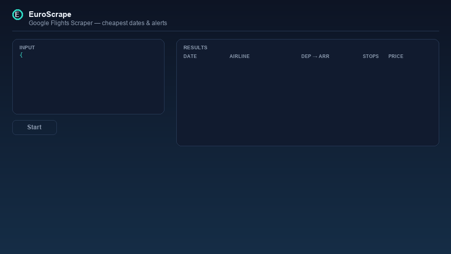

# EuroScrape: ready-to-use data scrapers (Apify Actors)

[](https://apify.com/euroscrape) [](#-articles--guides) [](https://apify.com/euroscrape)



Cloud scrapers for hotel and flight prices, public tenders, second-hand marketplaces, app reviews, company data and website technologies. No code and no servers needed: run them on [Apify](https://apify.com/euroscrape), schedule them, get alerts, and pay only per result.

This repository holds **input templates and real sample outputs** for each Actor, plus code snippets to run them from your own scripts. (The Actors' source code is not public.)

## 📦 Actors

| Actor | What you get | Price | Try it |
|---|---|---|---|
| [Google Hotels Scraper: Prices from Every Booking Site](https://apify.com/euroscrape/google-hotels-prices) | Hotel prices for any destination and dates, the price on every booking site (official website, Booking.com, Expedia…), rate parity, price calendars, price-drop alerts | $0.002 per hotel and date, +$0.003 with all booking sites | [▶ example](https://apify.com/euroscrape/google-hotels-prices/examples/hotel-price-on-every-booking-site) |
| [Ryanair Low Fare Finder: Cheapest Days, Anywhere & Alerts](https://apify.com/euroscrape/ryanair-low-fares) | Ryanair fare calendars (cheapest price per day, months ahead), every destination under your price cap from any airport, alerts on drops and new deals | $0.0005 per fare | [▶ example](https://apify.com/euroscrape/ryanair-low-fares/examples/fly-under-30-euros-from-paris-beauvais) |
| [Google Flights Scraper: Cheapest Dates, Prices & Price History](https://apify.com/euroscrape/google-flights-prices) | Flight prices for any route and dates: cheapest day to fly, price calendar, typical price range, price history, CO2, round trips, price-drop alerts | $0.002 per flight | [▶ example](https://apify.com/euroscrape/google-flights-prices/examples/cheapest-day-to-fly-berlin-alicante) |
| [EU Electricity Prices (Day-Ahead): All Zones & Cheap Hours](https://apify.com/euroscrape/eu-electricity-prices) | Hourly day-ahead spot prices for 40+ European bidding zones: tomorrow's prices, cheapest 3-hour window, negative-price alerts, years of history | $0.0002 per hour row | [▶ example](https://apify.com/euroscrape/eu-electricity-prices/examples/cheapest-electricity-hours-france) |
| [EU Public Tenders Scraper: TED, BOAMP, Procurement & Awards](https://apify.com/euroscrape/eu-public-tenders) | Open tenders and contract awards from all of Europe (TED) and France (BOAMP, DECP): deadlines, values in €, buyers, winners per lot, bids received | $0.003 per tender, $0.005 per award | [▶ example](https://apify.com/euroscrape/eu-public-tenders/examples/daily-alerts-eu-software-tenders) |
| [Vinted Scraper: 26 Countries, Deals, Alerts & Seller Data](https://apify.com/euroscrape/vinted-scraper) | Search Vinted in 26 countries: prices with buyer fees, brand, size, condition, seller ratings, cheapest-country summary, alerts on new listings and price drops | $0.001 per item | [▶ example](https://apify.com/euroscrape/vinted-scraper/examples/vinted-new-listing-alerts-nike-fr) |
| [EU Second-Hand Marketplaces Scraper: Vinted, OLX & More](https://apify.com/euroscrape/eu-marketplace-deals) | One search on the top second-hand marketplace of 18 European countries: prices in €, deal score, cheapest country, resale margin | $0.002 per listing | [▶ example](https://apify.com/euroscrape/eu-marketplace-deals/examples/compare-iphone-prices-across-18-countries) |
| [Website Tech Stack Detector: 280+ Technologies, Leads & Signals](https://apify.com/euroscrape/website-intelligence) | Technologies of any website (CMS, e-commerce, analytics…), company identity from the legal notice, contacts and sales signals | $0.02 per website | [▶ example](https://apify.com/euroscrape/website-intelligence/examples/tech-stack-and-sales-signals-of-a-website) |
| [EU VAT Number Validator (VIES): Bulk Check, Proof & Alerts](https://apify.com/euroscrape/vat-validator) | Bulk VAT validation against the EU's official VIES registry: company names, official consultation proof for tax audits, alerts when a customer's number becomes invalid | $0.002 per check | [▶ example](https://apify.com/euroscrape/vat-validator/examples/check-eu-vat-numbers-in-bulk) |
| [Impressum & Legal Notice Scraper: VAT, Registry, Contacts](https://apify.com/euroscrape/company-identity) | Legal name, registry numbers and VAT IDs from any European website, checked against official registries | $0.004 per website | [▶ example](https://apify.com/euroscrape/company-identity/examples/legal-identity-behind-any-eu-website) |
| [France Fuel Prices: Cheapest Stations Near You & Alerts](https://apify.com/euroscrape/france-fuel-prices) | Official live prices of all ~10,000 French stations: cheapest Diesel, SP95/98, E10, E85, LPG around any point, with distances, medians, local spread and price-drop alerts | $0.001 per station | [▶ example](https://apify.com/euroscrape/france-fuel-prices/examples/cheapest-diesel-around-lyon) |
| [France Real Estate Sold Prices (DVF)](https://apify.com/euroscrape/france-property-prices) | Every sale registered by the French State: real prices, €/m², surfaces, addresses, GPS, median prices and year-by-year trends per city, alerts on new sales | $0.0005 per sale | [▶ example](https://apify.com/euroscrape/france-property-prices/examples/apartments-sold-in-grenoble-real-prices) |
| [France Energy Ratings (DPE): Homes, Energy Sieves & Alerts](https://apify.com/euroscrape/france-energy-ratings) | Official ADEME energy certificates of French homes: energy and CO2 class, address, GPS, consumption, estimated yearly bill, insulation quality, F/G share per city, alerts on new certificates | $0.001 per certificate | [▶ example](https://apify.com/euroscrape/france-energy-ratings/examples/energy-sieves-f-g-homes-in-paris) |
| [French Companies Scraper: SIRENE Leads, Directors & Emails](https://apify.com/euroscrape/france-companies) | Every French company by activity, area and size, with finances and optionally a verified website, emails and phones | $0.004 per company | [▶ example](https://apify.com/euroscrape/france-companies/examples/french-plumbing-companies-with-contacts) |
| [UK Companies House Scraper: Directors, Leads & Emails](https://apify.com/euroscrape/uk-companies) | UK companies by SIC code and location, with officers and optionally website, emails and phones | $0.004 per company | [▶ example](https://apify.com/euroscrape/uk-companies/examples/new-london-software-companies-with-officers) |
| [App Store Reviews Scraper + Google Play Reviews (All Countries)](https://apify.com/euroscrape/app-reviews) | Reviews from both stores in 58 countries: rating, text, version, developer reply, summary by version and country, alerts on new negative reviews | $0.0002 per review | [▶ example](https://apify.com/euroscrape/app-reviews/examples/track-negative-app-reviews-spotify) |
| [Kleinanzeigen Scraper: Deal Finder & Price-Drop Alerts](https://apify.com/euroscrape/kleinanzeigen-scraper) | German classifieds with a deal score vs. market price, view counts and instant alerts | $0.002 per ad | [▶ example](https://apify.com/euroscrape/kleinanzeigen-scraper/examples/instant-alerts-new-kleinanzeigen-ads) |

Each run also costs $0.003 to start. Apify subscribers get 10–30% off.

## 🚀 Run an Actor from your code

Get your API token in [Apify Console → Settings → Integrations](https://console.apify.com/settings/integrations).

**curl**
```bash
curl -X POST "https://api.apify.com/v2/acts/euroscrape~google-hotels-prices/run-sync-get-dataset-items?token=$APIFY_TOKEN" \
  -H "Content-Type: application/json" \
  -d @examples/google-hotels-prices/input.json
```

**Python** (`pip install apify-client`)
```python
from apify_client import ApifyClient

client = ApifyClient("YOUR_APIFY_TOKEN")
run = client.actor("euroscrape/eu-public-tenders").call(run_input={
    "keywords": ["software"],
    "countries": ["DE", "FR", "PL"],
    "publishedWithinDays": 7,
})
for item in client.dataset(run["defaultDatasetId"]).iterate_items():
    print(item.get("title"), item.get("deadline"), item.get("url"))
```

**JavaScript** (`npm install apify-client`)
```js
import { ApifyClient } from 'apify-client';

const client = new ApifyClient({ token: process.env.APIFY_TOKEN });
const run = await client.actor('euroscrape/eu-marketplace-deals').call({ searchQueries: ['nintendo switch oled'] });
const { items } = await client.dataset(run.defaultDatasetId).listItems();
console.log(items.filter((x) => x.type === 'listing').slice(0, 5));
```

## 📁 Examples

Each folder in [`examples/`](examples) has:
- `input.json`: a working input you can paste in Apify Console or send to the API,
- `output-sample.json`: one real result (personal data removed).

## 🔔 Monitoring

Hotels, tenders, second-hand marketplaces, Kleinanzeigen and company registries have a monitoring mode: set a `monitorName`, schedule the Actor (Apify Console → Schedules), and each run returns only what's new (new tenders, new listings, new companies, price drops…). Hotels, tenders and marketplaces can also push alerts to Slack, Telegram, Discord or any webhook.

## 💬 Feedback

Missing a field, a country or a source? Say it in a review on the Actor's page in Apify Store.
## 📚 Articles & guides

Real numbers, real code, from building and running these Actors:

- [Check a hotel's price on every booking site (and spot rate-parity gaps) without writing a scraper](articles/01-google-hotels.md)
- [Same used iPhone, 62% price gap - comparing second-hand prices across 18 European countries](articles/02-second-hand-europe.md)
- [57% of the contract lots I sampled got a single bid - mining EU tenders and award winners from TED](articles/03-eu-tenders.md)
- [Find websites running WordPress, WooCommerce or Shopify - and the ones that need your help](articles/04-tech-stack-leads.md)
- [Build B2B lead lists from official company registers (France SIRENE and UK Companies House)](articles/05-company-registers-leads.md)
- [The same flight cost $362 or $162 depending on the day - building a fare calendar from Google Flights](articles/06-google-flights-calendar.md)
- [Get every new 1-star review of your app in Slack (App Store and Google Play, 58 countries)](articles/07-app-reviews-alerts.md)
- [When a Vinted search finds nothing, it quietly shows you popular junk - here is how to detect it](articles/08-vinted-fallback-feed.md)
- [Zero-rating an intra-EU invoice? Without a VIES consultation number, you may owe the VAT yourself](articles/09-vat-vies-proof.md)
- [France publishes every property sale as open data - most people compute the price per m² wrong](articles/10-dvf-prix-immobilier.md)
- [Night power is not the cheapest, and the cheapest fuel station is often a ghost - two things official energy data taught me](articles/11-energy-two-assumptions.md)


## 🧪 Example projects

Small, runnable Python projects built on these Actors (one file each, `pip install apify-client`):

| Project | What it does |
|---|---|
| [`examples/flight-fare-calendar`](examples/flight-fare-calendar/fare_calendar.py) | Prints the cheapest day to fly on your routes as a fare calendar, and writes `fares.csv` |
| [`examples/hotel-rate-parity-monitor`](examples/hotel-rate-parity-monitor/parity.py) | Checks whether a hotel's official site is the cheapest place to book it, night by night |
| [`examples/eu-tenders-slack-alerts`](examples/eu-tenders-slack-alerts/tenders.py) | Posts new EU public tenders matching your keywords to a Slack channel, daily |

