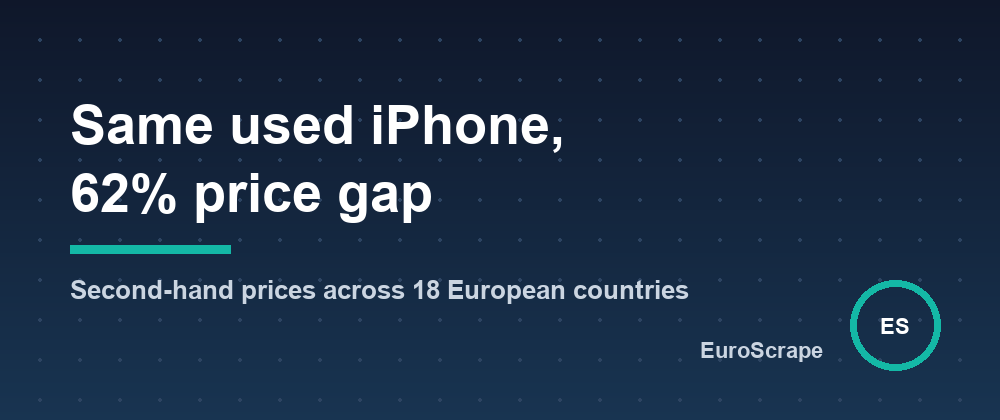

# Same used iPhone, 62% price gap - comparing second-hand prices across 18 European countries



A used **iPhone 13 128 GB** had a median asking price of **€172 in Poland** and **€279 in Finland** on the same day. A **Nintendo Switch OLED**: €183 in Poland, €266 in Denmark.

Those numbers come from one search run on the main second-hand marketplace of 18 European countries at once, with every price converted to euros. Here's how it works and what you can do with it.

## The problem

Every country has its own second-hand leader: Kleinanzeigen in Germany, Marktplaats in the Netherlands, Subito in Italy, Wallapop in Spain, OLX in Poland, Portugal, Romania and Bulgaria, Bazoš in Czechia and Slovakia, Blocket, DBA, FINN and Tori in the Nordics, Vinted almost everywhere. Different sites, languages, currencies and listing formats, so nobody compares them.

## One search, 18 countries

The [EU Second-Hand Marketplaces Scraper](https://apify.com/euroscrape/eu-marketplace-deals) (an Apify Actor) takes a product name and returns comparable listings from all of them:

```json
{ "searchQueries": ["iphone 13 128gb"], "maxItemsPerMarketplace": 50 }
```

Each listing comes back with the price in euros (ECB rates of the day), a **market price** computed from its most similar listings across Europe, a 0–100 **deal score**, the **cheapest and most expensive country**, and the **resale margin** in the most expensive one:

```json
{
  "marketplace": "OLX Poland",
  "country": "PL",
  "title": "Nintendo Switch Oled 64gb",
  "price": 650,
  "currency": "PLN",
  "priceEur": 148.9,
  "marketPriceEur": 240,
  "priceVsMarketPct": -38,
  "dealScore": 88,
  "bestResaleCountry": "DK",
  "potentialMarginEur": 126.47
}
```

## Median price per country (real run)

| Country | iPhone 13 128 GB | Switch OLED |
|---|---|---|
| 🇵🇱 Poland | €172 | €183 |
| 🇷🇴 Romania | €185 | €227 |
| 🇩🇪 Germany | €215 | €200 |
| 🇳🇱 Netherlands | €220 | €200 |
| 🇪🇸 Spain | €220 | €190 |
| 🇮🇹 Italy | €250 | €218 |
| 🇩🇰 Denmark | €261 | €266 |
| 🇫🇮 Finland | €279 | €230 |

A free **market summary** item gives these medians (plus 25th/75th percentiles and the cheapest listing per country) for every search.

## Clean comparisons are the hard part

A raw search for "iphone 13" returns cases, chargers, broken phones, "wanted" ads and iPhone 13 **Pro** listings. If you average that, the numbers are meaningless. The Actor:

- recognises accessories sold alone, broken items and wanted ads in 16 languages and keeps them out of the statistics,
- doesn't let "iPhone 13 Pro" or "Switch Lite" pollute an "iphone 13" or "switch oled" search,
- flags prices below 40% of the market as `suspiciously_low` (scam, spare part or typo?) instead of calling them deals.

## Use cases

- **Resellers**: buy where it's cheap, sell where it isn't (`potentialMarginEur`, before shipping and fees).
- **Deal hunters**: schedule it with a `monitorName` and get only new listings and price drops, on Telegram, Discord or Slack.
- **Pricing teams and refurbishers**: real private-market prices per country for any product.

## From Python

```python
from apify_client import ApifyClient

client = ApifyClient("YOUR_APIFY_TOKEN")
run = client.actor("euroscrape/eu-marketplace-deals").call(run_input={
    "searchQueries": ["nintendo switch oled"],
    "countries": ["DE", "PL", "ES", "DK"],
    "maxItemsPerMarketplace": 30,
})
for x in client.dataset(run["defaultDatasetId"]).iterate_items():
    if x["type"] == "marketSummary":
        for c in x["countries"]:
            print(c["country"], c["medianEur"])
```

It costs $0.002 per listing ($2 per 1,000) and $0.003 per run; the market summary is free.

Input templates and sample outputs: [github.com/EuroScrape/apify-actors](https://github.com/EuroScrape/apify-actors).

---

*Part of the [EuroScrape](https://apify.com/euroscrape) actor collection — [all articles](README.md).*
