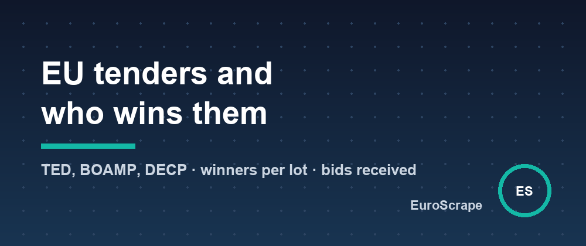

# 57% of the contract lots I sampled got a single bid - mining EU tenders and award winners from TED



I pulled one week of public contract **awards** in IT, software and medical supplies from Poland, Germany, France, the Netherlands and Italy: 60 award notices, €141M in total, 179 different winning companies.

Of the 211 lots that reported how many bids they received, **57% got exactly one bid**. The average was 2 bids per lot. And 63% of the winners were SMEs.

That's one week and three categories, so don't quote it as a European statistic. But it shows what becomes possible when tender data is clean: competition analysis, supplier mapping, and of course finding contracts to bid on.

## Where the data comes from

- **TED** (Tenders Electronic Daily), the EU's official journal: every tender above EU thresholds, in all EU countries plus Norway, Switzerland and candidate countries. It has a free search API, and each award notice has an eForms XML with the result **lot by lot**: which company won, at what price, against how many bids.
- **BOAMP**: French national tenders below EU thresholds.
- **DECP**: every French contract awarded from €40,000, published by buyers.

All official open data, but in three formats, with values in many currencies, titles in 24 languages and winners buried in XML.

## One dataset for all of it

The [EU Public Tenders Scraper](https://apify.com/euroscrape/eu-public-tenders) (an Apify Actor) has two modes.

**Open tenders** you can still bid on:

```json
{
  "mode": "tenders",
  "cpvCodes": ["72", "48"],
  "countries": ["DE", "AT"],
  "minValueEur": 100000,
  "minDaysToDeadline": 10
}
```

Each tender comes with the deadline and days left, estimated value in euros, buyer and contact mailbox, category, lots and the link to the documents. A real one from the same week: "Pflege, Weiterentwicklung und Support der Individualsoftware SolumSTAR", estimated at €31M, deadline for requests to participate on 29 October.

**Contract awards** with winners:

```json
{ "mode": "awards", "cpvCodes": ["33"], "countries": ["PL"], "publishedWithinDays": 30 }
```

Each award lists every winning company (name, national ID, city, size, contact, value won) and every lot (title, bids received, winner, value). A real example: a Warsaw military hospital's medicines tender split into 18 lots and 10 winners; one wholesaler won 4 lots worth €937k.

## Search in English, find every language

Keywords are also matched against the official CPV category of each notice in 8 languages. So `software` finds a German *Softwarepflege* tender or a Polish *oprogramowanie* tender even though neither title contains the English word. Notices that only mention your keyword in passing ("submit via our software platform") are dropped.

## The free summary

Every run adds a summary item: value per country and category, top buyers and, for awards, top winners, average bids per lot, share of single-bid lots and share of SME winners. That's where the numbers at the top of this post come from.

## Daily alerts

Add a `monitorName`, schedule the Actor every morning with `publishedWithinDays: 3`, and plug in Slack, Telegram, Discord or a webhook: you get only the new notices.

## Cost

$0.003 per tender, $0.005 per award (winners lot by lot), $0.003 per run; summaries are free.

Input templates and sample outputs: [github.com/EuroScrape/apify-actors](https://github.com/EuroScrape/apify-actors).

---

*Part of the [EuroScrape](https://apify.com/euroscrape) actor collection — [all articles](README.md).*
