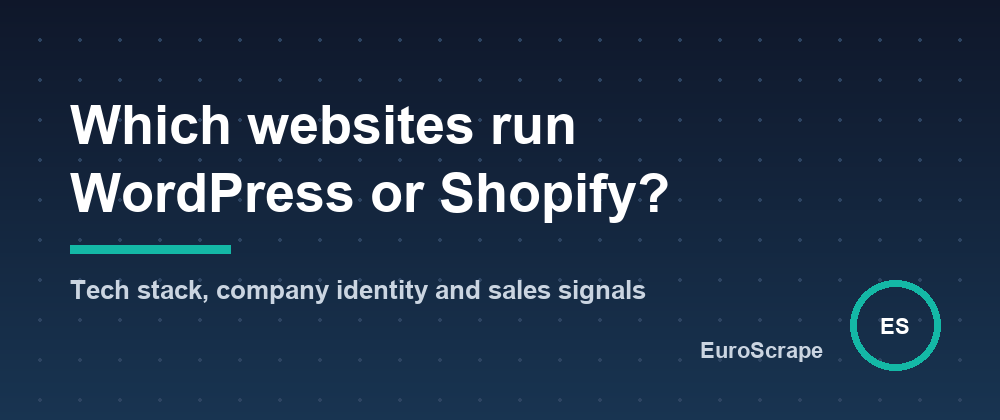

# Find websites running WordPress, WooCommerce or Shopify - and the ones that need your help



Agencies, freelancers and SaaS sales teams all ask the same question: **which companies use technology X, and which of them have a problem I can fix?**

Instead of looking it up in a database, [Website Tech Stack Detector](https://apify.com/euroscrape/website-intelligence) (an Apify Actor) checks the live website, so the answer is current, even for small local businesses (garages, dental practices, accountants, shops).

## What it returns for one website

A real example, a car repair shop in Cologne:

```json
{
  "domain": "ubiagarage.de",
  "companyName": "UBIA–Garage",
  "vatIds": ["DE180343005"],
  "cms": "WordPress",
  "technologiesByCategory": {
    "cms": ["WordPress"],
    "ecommerce": ["WooCommerce"],
    "page-builder": ["Divi", "Gutenberg blocks"],
    "consent": ["Usercentrics"],
    "server": ["Nginx"],
    "js-library": ["jQuery 3.7.1"]
  },
  "salesSignals": [
    { "code": "no_analytics", "label": "No analytics detected: they cannot measure their marketing." }
  ],
  "audit": { "https": true, "responseTimeMs": 686, "mobileViewport": true, "sslDaysLeft": 86 },
  "emails": ["info@ubia-garage.de"]
}
```

Three things in one pass:

1. **Technologies**: 280+ fingerprints (CMS, e-commerce, page builders, analytics, cookie consent, booking tools, chat, payments, hosting), with versions when the site exposes them.
2. **Company identity** from the legal notice (Impressum, mentions légales, aviso legal…): legal name, legal form, VAT and registry numbers, address, contact mailbox and phone.
3. **Sales signals** with an opportunity score: outdated WordPress or jQuery, end-of-life PHP, no HTTPS, no analytics, trackers without a consent tool, Google Fonts loaded from Google (a GDPR issue in Germany), slow server, expiring SSL certificate, not mobile-friendly, no legal notice…

## Start from a list or from a search

You don't need a list of domains. Give it a Google-style query and it finds the websites first:

```json
{ "searchQueries": ["Zahnarzt München", "dentist Bristol"], "resultsPerQuery": 50 }
```

Or bring your own list:

```json
{ "websites": ["example-shop.de", "another-clinic.fr"], "onlyWithTechnologies": ["WooCommerce"] }
```

`onlyWithTechnologies` keeps only the sites using a given tool, and `minOpportunityScore` keeps only the ones with something to fix.

## Who uses this

- **Web agencies**: local businesses on an outdated CMS or without HTTPS, with the right contact mailbox.
- **SaaS sales**: companies using a competitor's tool (booking widgets, cookie banners, shop systems).
- **Compliance and privacy consultants**: sites loading trackers without a consent tool, or Google Fonts from Google's servers.

## Cost

$0.02 per website analysed (technologies, identity, contacts and signals together), $0.004 per search page and $0.003 per run.

Input templates and sample outputs: [github.com/EuroScrape/apify-actors](https://github.com/EuroScrape/apify-actors).

---

*Part of the [EuroScrape](https://apify.com/euroscrape) actor collection — [all articles](../README.md#-articles--guides).*
