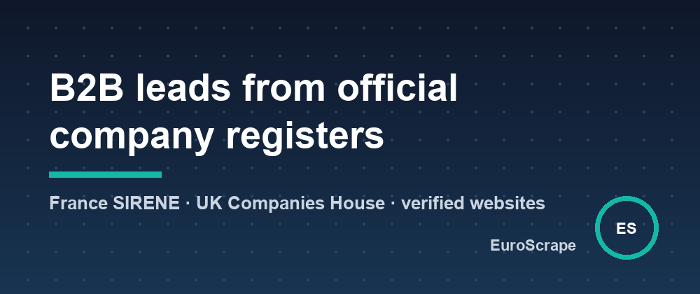

# Build B2B lead lists from official company registers (France SIRENE and UK Companies House)



France and the UK both publish their company registers as open data. That's every company, with its activity code, address, headcount band, creation date and, in the UK, its officers. It's the most complete B2B list you can get, and it's free.

What the registers don't give you is a **website, an email or a phone number**. That's the part sales teams actually need, so two Apify Actors fill it in:

- [French Companies Scraper (SIRENE)](https://apify.com/euroscrape/france-companies)
- [UK Companies House Scraper](https://apify.com/euroscrape/uk-companies)

## France: every company by activity, area and size

```json
{
  "nafCodes": ["43.22A", "43.22B"],
  "departments": ["42", "69"],
  "employeeRanges": ["11", "12"],
  "findContacts": true
}
```

That's plumbing and heating contractors in the Loire and Rhône departments with 10 to 49 employees. A real result (trimmed):

```json
{
  "name": "SOLAIRE CLIM CHAUFFAGE (LOIRE CLIM CHAUFFAGE)",
  "nafCode": "43.22B",
  "nafLabel": "Travaux d'installation d'équipements thermiques et de climatisation",
  "employees": { "label": "20 à 49 salariés", "min": 20, "max": 49 },
  "createdAt": "2020-10-30",
  "headquarters": { "city": "VEAUCHE", "postalCode": "42340", "department": "42" }
}
```

Two details that make the list usable:

- **No 10,000-result cap.** The official search API stops at 10,000 results. The Actor splits big searches (by department, size band, activity…) until every company is collected.
- **Websites are verified.** A website is only marked `verified_siren` when the site itself shows the company's SIREN number (French law requires it in the legal notice). Otherwise it's `probable` or left empty: no guessed domains sold as facts.

## UK: new incorporations, by SIC code and place

```json
{
  "sicCodes": ["62020"],
  "location": "London",
  "incorporatedInLastDays": 7,
  "includeOfficers": true
}
```

You get the company profile, accounts and confirmation-statement dates, and its officers. With `findContacts`, it looks for the company's website (checked against the company number when the site shows it), emails and phones.

## Monitoring

Both Actors have a monitoring mode: schedule them with a `monitorName` and each run returns only new companies, plus changes (new address, new officers, status changes) with the before and after values.

## Cost

$0.004 per company, plus $0.025 per company when a website and contacts are found. $0.003 per run.

## Use it responsibly

Registry data is public, but emails and phones of people are personal data: use them under the GDPR (legitimate interest, easy opt-out) and the PECR in the UK.

Input templates and sample outputs: [github.com/EuroScrape/apify-actors](https://github.com/EuroScrape/apify-actors).

---

*Part of the [EuroScrape](https://apify.com/euroscrape) actor collection — [all articles](README.md).*
