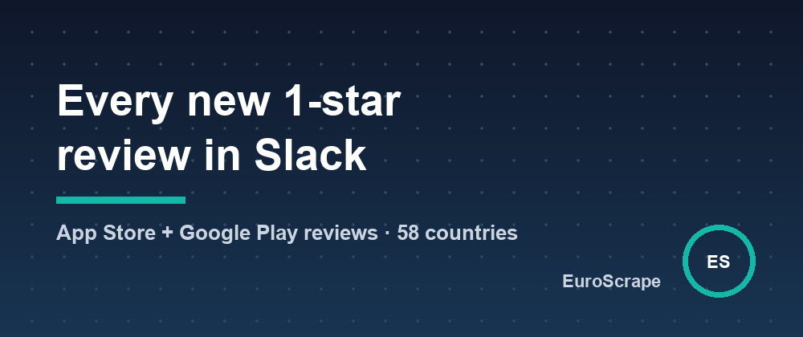

# Get every new 1-star review of your app in Slack (App Store and Google Play, 58 countries)



App teams usually see reviews late: someone opens App Store Connect or the Play Console once a week, in one country, and the angry 1-star review from Germany sits there unanswered.

I wanted the opposite: every new negative review, from both stores and every country, pushed to Slack within the hour. So I built [App Store Reviews Scraper + Google Play Reviews](https://apify.com/euroscrape/app-reviews) on Apify.

## Both stores from one input

```json
{ "appNames": ["Spotify"], "countries": ["us", "gb", "fr", "de"], "maxReviewsPerCountry": 100 }
```

Type the app name and it's found on both stores. App Store URLs, IDs (`id324684580`) and Play package names (`com.spotify.music`) work too. Each review comes with its rating, title, text, app version, date, helpful votes and, on Google Play, the developer's reply.

## The summary is where it gets useful

A free summary per app and store gives the rating distribution, the average rating **per app version** and **per country**, the share of negative reviews, the developer reply rate, and the most frequent words in 1-2 star reviews.

On a sample of 120 recent Google Play reviews of Spotify in three countries, the summary showed 49% negative reviews (recent reviews are always harsher than the overall 4.3 rating), a 5% developer reply rate, and complaints clustering around words like *premium*, *offline* and *update*.

## The Slack alert

```json
{
  "apps": ["com.yourcompany.app", "id1234567890"],
  "countries": ["us", "gb", "de", "fr"],
  "monitorName": "my-app-reviews",
  "alertMaxRating": 2,
  "slackWebhookUrl": "https://hooks.slack.com/services/…"
}
```

Schedule it every hour. The first run saves the current reviews as a baseline; after that, each run returns only new reviews, and every new review rated 2 stars or less goes to Slack (Telegram, Discord and webhooks work too).

## Good to know

- Apple publishes the 500 most recent reviews per country, so add countries to go further back. Google Play has no such limit.
- Reviewer names are not collected unless you ask for them.
- Price: $0.0002 per review ($0.20 per 1,000), app details and summaries free.

Input templates and sample outputs: [github.com/EuroScrape/apify-actors](https://github.com/EuroScrape/apify-actors).

---

*Part of the [EuroScrape](https://apify.com/euroscrape) actor collection — [all articles](../README.md#-articles--guides).*
