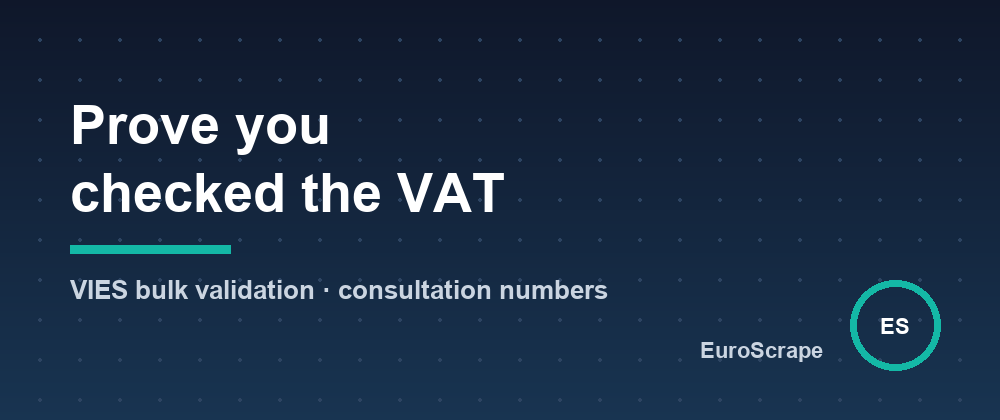

# Zero-rating an intra-EU invoice? Without a VIES consultation number, you may owe the VAT yourself



When an EU business sells B2B to another member state, the invoice usually goes out without VAT - the customer self-accounts for it. One condition: the seller must have **verified the customer's VAT number in VIES**, the European Commission's registry. If the number turns out invalid and you can't prove you checked, the tax authority can make *you* pay the VAT.

VIES has a public page, but checking 300 customers by hand every quarter is nobody's idea of a job. So I built a bulk validator on Apify: [EU VAT Number Validator (VIES)](https://apify.com/euroscrape/vat-validator). A few things I learned about the API on the way:

## The REST endpoint is simple - and returns the legal proof

```bash
curl -X POST https://ec.europa.eu/taxation_customs/vies/rest-api/check-vat-number \
  -H 'content-type: application/json' \
  -d '{"countryCode":"IE","vatNumber":"6388047V","requesterMemberStateCode":"FR","requesterNumber":"40303265045"}'
```

A real answer:

```json
{
  "valid": true,
  "name": "GOOGLE IRELAND LIMITED",
  "address": "3RD FLOOR, GORDON HOUSE, BARROW STREET, DUBLIN 4",
  "requestIdentifier": "WAPIAAAAaD5Jk8-i"
}
```

That `requestIdentifier` only appears when you pass your own VAT number as requester. It is the **consultation number**: the Commission's dated record that you performed the check. Store it next to the invoice; it's exactly what an auditor asks for.

## Quirks worth knowing

- **Germany answers "valid" but hides the name and address** (`"---"`). A few member states do; it's a policy choice, not an error.
- **Member states go down.** VIES queries each national registry live, and `MS_UNAVAILABLE` or `MS_MAX_CONCURRENT_REQ` are routine. Retry with backoff (2 s, 5 s, 10 s), and if it still fails, report "unavailable" - never a false "invalid". My validator doesn't charge for unanswered numbers.
- **Syntax first.** Each country has a strict format (`NL` is 9 digits + `B` + 2 digits, `IE` allows letters inside…). Validating the 28 patterns locally avoids wasting API calls - and `FR 40-303.265 045` should be normalized, people paste VAT numbers in every imaginable shape.
- **GB is gone, XI is not.** Great Britain left VIES with Brexit (HMRC's replacement API requires OAuth credentials), but Northern Ireland still lives in VIES under the `XI` prefix.
- **Greece is `EL`**, not `GR`. Accept both, send `EL`.

## Monitoring beats checking

A VAT number isn't valid forever - companies deregister, merge, go bankrupt. The validator has a monitor mode: schedule it monthly on your customer list, and it flags `became_invalid` numbers and pushes a Telegram/Slack/webhook alert, before the next invoice goes out wrong.

1,000 checks cost about $2, consultation proof included. Input templates and sample outputs: [github.com/EuroScrape/apify-actors](https://github.com/EuroScrape/apify-actors).

---

*Part of the [EuroScrape](https://apify.com/euroscrape) actor collection — [all articles](../README.md#-articles--guides).*
