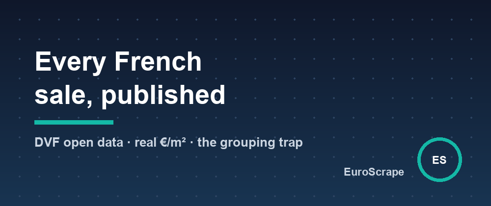

# France publishes every property sale as open data - most people compute the price per m² wrong



France's DVF dataset ("Demandes de valeurs foncières") records **every notarized property sale**: the real price paid, the address, the surface, down to GPS coordinates. It's the ground truth behind every French price-estimate website, and it's free.

It also has a trap that most quick analyses fall into.

## One sale ≠ one row

DVF spreads a single sale (a *mutation*) over several rows: one per unit involved. An apartment sold with a cellar and two parking spots is **four rows, each repeating the full sale price**. Sum the rows, or divide the price by one row's surface, and your €/m² is garbage.

Real example from Grenoble, 2024: a sale of two apartments for €160,000 total. Naive row-level processing yields either two "sales" of €160,000 each, or a €/m² computed on half the surface - both wrong.

The correct approach:

1. **Group rows by `id_mutation`.**
2. Take the price once.
3. Sum the living surfaces of the dwellings; count cellars and parkings separately.
4. Compute €/m² **only when the sale contains exactly one dwelling** with a known price and surface. Everything else gets `pricePerM2: null`, honestly.

On Grenoble 2024, that filter keeps 2,332 clean apartment sales out of 2,408 - enough for solid statistics, without polluting them.

## What clean DVF data looks like

I packaged all of this into [France Real Estate Sold Prices (DVF)](https://apify.com/euroscrape/france-property-prices) on Apify. One input:

```json
{ "locations": ["Grenoble"], "years": [2024, 2025], "propertyTypes": ["apartment"] }
```

City names, postal codes or INSEE codes all work; Paris, Lyon and Marseille expand to their arrondissements automatically. Each sale comes back with price, €/m², rooms, address and GPS, and a free summary gives the market picture - real numbers:

- Grenoble apartments (≥30 m², ≥2 rooms): **3,716 sales** in 2024-2025, median **2,381 €/m²**;
- trend: 2,389 €/m² (2024) → 2,370 €/m² (2025);
- most active street: Cours de la Libération, 118 sales.

## Things worth knowing about DVF

- **Freshness**: the State publishes twice a year (around April and October), a few months behind the notary acts. 2025 is partial until the final release.
- **Coverage**: all of France except Alsace-Moselle (separate land registry) and Mayotte.
- **New builds**: off-plan sales (VEFA) are flagged; in Grenoble they were 1.6% of 2024-2025 apartment sales.
- **Monitoring**: since releases are periodic, a monthly scheduled run with a monitor name flags the new sales of your area when they land, with Telegram/Slack/webhook alerts.

Input templates and sample outputs: [github.com/EuroScrape/apify-actors](https://github.com/EuroScrape/apify-actors).

---

*Part of the [EuroScrape](https://apify.com/euroscrape) actor collection — [all articles](../README.md#-articles--guides).*
