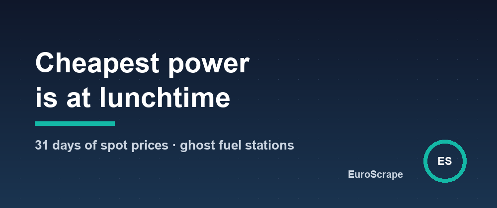

# Night power is not the cheapest, and the cheapest fuel station is often a ghost - two things official energy data taught me




Two "everybody knows" rules about energy prices: electricity is cheapest at night, and the cheapest station is the one at the top of the price list. I checked both against the official data. Neither held.

## 1. The cheapest three hours of electricity are at lunchtime

Europe's day-ahead market now prices electricity in 15-minute steps, published every day around 13:00 CET for the next day. I took 31 days of French prices (3 September - 3 October 2026) and, for each day, looked for the cheapest 3-hour window: the lowest average over 12 consecutive quarter-hours.

- On **29 days out of 31**, that window started between 10:00 and 16:00. The median start was **12:30**.
- In Germany-Luxembourg, it was **31 days out of 31** (median start 12:15).
- The classic "off-peak" slot, 01:00-04:00, cost on average **104 €/MWh more** than the best window of the same day in France - about 10 cents per kWh at wholesale level.
- The gap between the cheapest and the most expensive 3-hour window of a day averaged **187 €/MWh**.
- Prices went **negative on 6 days** in France and 7 in Germany.

The reason is solar: at midday there is more power than demand, and in the evening, when the sun is gone and everyone cooks, prices peak (the most expensive window started around 18:00 on the days I looked at in detail).

Two honest caveats. This is late summer; in the dark months the picture shifts, which is exactly why a fixed schedule is the wrong tool and a daily check is the right one. And these are wholesale prices: your bill adds taxes and grid fees, so what the data gives you is the *shape* of the day - which matters if you are on a dynamic tariff or simply want to run heavy loads when power is abundant.

Getting tomorrow's window is one call to [EU Electricity Prices](https://apify.com/euroscrape/eu-electricity-prices):

```json
{ "zones": ["FR"], "monitorName": "fr-spot", "alertBelowEurMwh": 0 }
```

Each day comes back with a free summary - `cheapest3hWindow`, `priciest3hWindow`, the negative quarter-hours - and can be pushed to Telegram, Slack or a webhook (Home Assistant, n8n) right after the auction.

## 2. The cheapest fuel station is often a ghost

France publishes the price of every fuel at every station in one open feed - the data behind prix-carburants.gouv.fr. Sort it by price and you get the cheapest station. Except that stations only send an update when they change a price, and some stop sending anything.

On the day I measured, the feed held 31,146 prices for 9,258 stations:

- **11.2%** of the prices were more than 14 days old;
- **2.7%** were more than 30 days old.

And a stale price does not land randomly in the list: whenever prices have gone up since, the frozen one is the *lowest*, and it floats to the top of any cheapest-first list. Around Paris 15e, the cheapest E10 in the raw feed was €1.88 - declared in August 2025, fourteen months earlier. Drop everything older than 30 days and the real cheapest was €1.99, updated that same morning.

So [France Fuel Prices](https://apify.com/euroscrape/france-fuel-prices) now ignores prices older than 30 days by default (`maxPriceAgeDays`, set it to 0 to keep everything), reports how many it left out, and computes its free summary over every station in the radius:

```json
{ "locations": ["Grenoble"], "radiusKm": 8, "fuels": ["Gazole"] }
```

Around Grenoble that gave 27 stations and a Diesel spread of **29.9 cents per litre** between the cheapest and the dearest - 15 € on a 50-litre tank, none of those prices being older than 30 days.

## The common lesson

Both feeds are official, free and accurate. Both still mislead if you read them with the obvious assumption. With open data, the timestamp is part of the value: look at *when* before you look at *how much*.

Input templates and sample outputs: [github.com/EuroScrape/apify-actors](https://github.com/EuroScrape/apify-actors).

---

*Part of the [EuroScrape](https://apify.com/euroscrape) actor collection — [all articles](../README.md#-articles--guides).*
