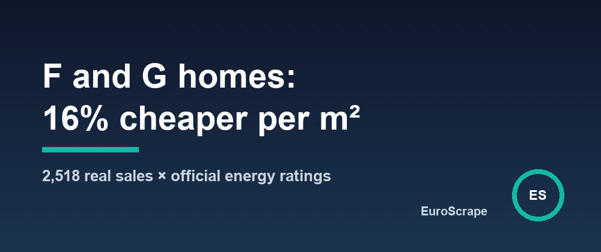

# I matched 2,518 apartment sales to their energy certificates - F and G homes sold 16% cheaper per m²




France is phasing "energy sieves" out of the rental market: homes rated G can no longer be let under a new lease since 2025, F follows in 2028, E in 2034. Everyone repeats that these homes sell at a discount. Two official open datasets make it possible to measure it instead of repeating it - if you can join them.

## Two registers, no common key (almost)

- **DVF** lists every notarized property sale: price, date, surface, address.
- **ADEME's DPE dataset** lists every energy performance certificate issued since July 2021: class A to G, consumption, address.

Neither knows about the other. But DVF carries the street code and house number of each sale, and that is exactly what France's national address ID is made of: `commune_streetcode_number`. ADEME stores the same ID on every certificate. Rebuild it from DVF and, in Grenoble, **96-97% of the addresses sold are found in the certificate register**.

## An address is a building, not a home

That is where a naive join goes wrong: one address can hold dozens of flats and dozens of certificates. To find the certificate of the flat that was actually sold, three more things have to agree:

1. **the property type** (apartment or house);
2. **the surface**: the Carrez surface written in the deed and the surface on the certificate often match to the decimal (65.31 m² vs 65.3 m²) - I require them within 1 m²;
3. **the date**: a certificate is mandatory to sell, so the right one was issued before the sale - typically a few months before (median: about six months).

And one rule matters more than the others: **when several flats of a building fit and their classes differ, attach nothing**. A wrong class is worse than a missing one.

With that, 2,518 of the 4,559 eligible apartment sales of Grenoble in 2024-2025 get a class (55%): 1,533 on the Carrez surface, 985 on the built surface when no Carrez surface is recorded. Where both methods could be applied, they agreed on the class 96% of the time.

## The numbers

Median price per m², apartments sold in Grenoble, 2024-2025:

| Class | Sales | Median €/m² |
|---|---|---|
| A | 15 | 3,317 |
| B | 103 | 2,727 |
| C | 760 | 2,802 |
| D | 1,039 | 2,398 |
| E | 447 | 2,386 |
| F | 104 | 2,145 |
| G | 50 | 2,173 |

Taken together, **F and G sold at 2,146 €/m² against 2,557 €/m² for C and D: 16% less**. A and B sold 8% above C and D.

## The trap in that number

Badly rated flats are small: the median G flat sold was 34 m², the median C flat 66 m². Small flats always cost more per m², so mixing sizes *hides* part of the discount. Comparing like with like:

- 40-60 m²: F and G sold **24% cheaper** than C and D (47 sales);
- 60-80 m²: **18% cheaper** (25 sales);
- under 40 m²: 7% cheaper (67 sales);
- over 80 m²: 16% cheaper (14 sales).

The samples get thin once you slice, so read these as orders of magnitude, not as a tariff. And it is a correlation: old buildings, their location and their general condition come with the class. But the direction is the same in every size band, and it is measured on real notarized prices, not on asking prices.

## Reproduce it for your city

The matching is built into [France Real Estate Sold Prices (DVF)](https://apify.com/euroscrape/france-property-prices):

```json
{ "locations": ["Grenoble"], "years": [2024, 2025], "propertyTypes": ["apartment"], "maxSalesPerLocation": 6000 }
```

Each sale comes back with `energyRating`, `energyRatingMatch` (`high` or `medium`) and the certificate date, and the free summary gives the median €/m² per class. To look at the certificates themselves - every F and G home of a city, with consumption and insulation quality - there is [France Energy Ratings (DPE)](https://apify.com/euroscrape/france-energy-ratings).

One legal note if you publish results: DVF is open data, but French law forbids making its individual sale records indexable by search engines. Aggregates like the table above are fine; a public page per sale is not.

Input templates and sample outputs: [github.com/EuroScrape/apify-actors](https://github.com/EuroScrape/apify-actors).

---

*Part of the [EuroScrape](https://apify.com/euroscrape) actor collection — [all articles](../README.md#-articles--guides).*
