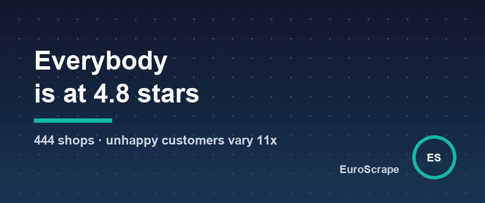

# A 4.8-star shop tells you nothing - across 444 German online shops the rating fits in a third of a point, while the share of 1 and 2 star reviews varies 11x



Trusted Shops is one of the most common trustmarks on German online shops. Each certified shop has a public profile with its rating out of 5, the number of reviews collected over the last twelve months, and the count of reviews per star.

I read 444 of those profiles: the first results of the directory for three everyday searches - garden (165 shops), jewellery (162) and furniture (173, limited to shops with 500 reviews or more), duplicates removed. Together they collected 1,583,275 reviews in twelve months.

Three things stood out.

## 1. Everybody is at 4.8

The median rating is **4.82**. Eight shops out of ten sit between 4.58 and 4.92: a band of a third of a point. 93.7% are at 4.5 or more, and exactly one shop out of 444 is under 4.0.

If you compare two shops by their stars - as a buyer, as a marketplace, or to qualify a prospect - you are comparing 4.79 with 4.84. That difference carries no information you can act on.

## 2. The share of unhappy customers varies 11x

The same profiles give the number of 1 and 2 star reviews. Among the 391 shops with at least 100 reviews a year:

- the median shop has **2%** of 1 and 2 star reviews;
- the best tenth is under **0.6%**;
- the worst tenth is over **6.6%**, and the maximum is 31.2%.

That is an 11x gap between the two ends, on shops that all look the same from the outside. And it is not explained by the rating: among the 151 shops rated between 4.75 and 4.85, the share of negative reviews goes from 0.3% to 5%.

The reason is arithmetic. When nine customers out of ten leave five stars, the average is glued to the ceiling: a shop with 2% of one-star reviews and 98% of five-star reviews averages 4.92, and a shop with three times as many angry customers averages 4.76. The average moves by a few hundredths while the number of people with a real problem triples.

## 3. Bigger shops, more complaints - and furniture is harder than jewellery

Shops collecting 100 to 999 reviews a year have a median of 1.8% negative reviews; those above 5,000 a year are at 2.65%. In furniture the gap is wider: 2.9% for the small ones, 5.35% for the large ones.

The category matters too: the median furniture shop has 2.8% of negative reviews, against 1.8% for garden and 1.7% for jewellery. A plausible reason: heavy parcels, long delivery times and assembly leave more room for things to go wrong than a necklace in an envelope.

One more figure for anyone who sells to online shops: review volume is extremely concentrated. The top tenth of the sample (44 shops) collects **58%** of all reviews; the bottom half collects 5.6%. The median shop gets 1,118 reviews a year, a quarter get fewer than 300, a quarter more than 3,250. Since shops invite buyers to leave a review after an order, that count is a usable public proxy for order volume.

## What I would do with this

- **Comparing shops**: ignore the stars, compute `(1-star + 2-star) / reviews over 12 months`. It separates shops that the rating puts in the same basket.
- **Watching your own shop**: an alert on every new 1 or 2 star review tells you something the average will only show months later, if ever.
- **Prospecting**: sort by reviews over twelve months, not by all-time totals - half of these shops joined before 2015, and old totals say little about today's activity.

## How the numbers were produced

The sample is not random: it is what the directory returns first for three keywords on the German market, so it leans towards established shops. The figures are those published on each profile on 3 October 2026.

I collected the profiles with the [Trusted Shops Scraper](https://apify.com/euroscrape/trusted-shops-scraper) on Apify, which returns one row per shop with the star counts already split out:

```json
{
  "searchTerms": ["garten", "schmuck"],
  "countries": ["DE"],
  "maxShopsPerSearch": 165,
  "membersOnly": true
}
```

```python
shops = [s for s in items if s["type"] == "shop" and (s["reviewsLast12Months"] or 0) >= 100]
for s in shops:
    s["negative_share"] = (s["stars"]["1"] + s["stars"]["2"]) / s["reviewsLast12Months"]
shops.sort(key=lambda s: s["negative_share"])
```

Each row also carries `negativeSharePct`, so the two lines above are only there to show there is no trick. The same Actor exports the reviews themselves, and can alert you on new negative ones.

One design choice worth stating: reviews are exported without anything about the people who wrote them - no name, no city, no profile - and the contact details of sole traders are left out unless you ask for them.

Input templates and sample outputs: [github.com/EuroScrape/apify-actors](https://github.com/EuroScrape/apify-actors).

---

*Part of the [EuroScrape](https://apify.com/euroscrape) actor collection — [all articles](../README.md#-articles--guides).*
