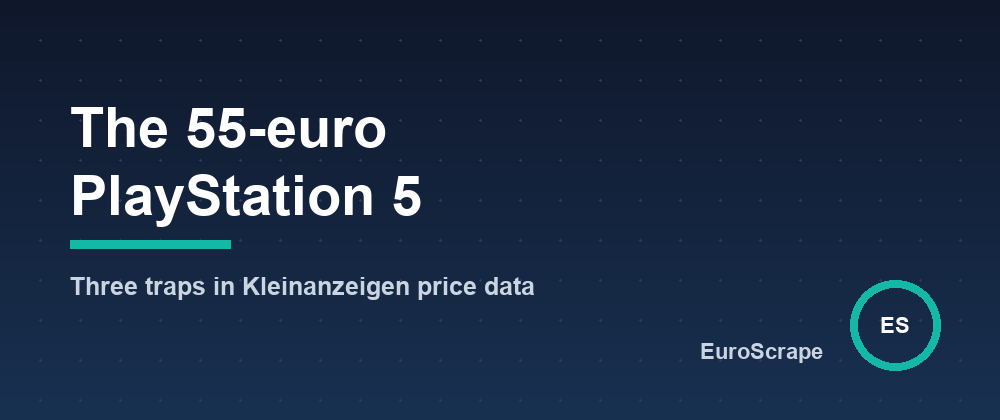

# The median "PlayStation 5" on Kleinanzeigen costs 55 euros - three traps in second-hand price data



While building a [Kleinanzeigen scraper](https://apify.com/euroscrape/kleinanzeigen-scraper), I wanted every ad to come with a market price, so that a good deal stands out. The first version did the obvious thing: take the median price of the search.

For `playstation 5` in Hamburg and Cologne, on 29 September 2026, that median was **55 euros**, over 36 priced offers. A PS5 for 55 euros would be news. Here is what was wrong, in three traps, measured on 370 offers from five searches (e-bike, Fahrrad, iPhone 13, iPhone 15, PlayStation 5).

## Trap 1: a keyword search returns the accessories

Of the 36 offers, 24 were under 150 euros: controllers at 25 to 75 euros, games at 12 to 45. Only 8 were at 300 euros or more, and those are the consoles: six between 500 and 600, a PS5 Pro at 1,150 and one optimistic ad at 2,750.

The median of the search describes the mix of what people sell around a product, not the product. Same thing for `iphone 13`: 18 of 67 priced offers were under 100 euros - cases, screen protectors, a display repair.

## Trap 2: half of the prices are an opening bid

Kleinanzeigen lets sellers mark a price as **VB** (*Verhandlungsbasis*, negotiable). In the sample, 184 of 370 offers were VB: half. Twelve of them had no number at all, just "VB", and two were *Zu verschenken*, free to collect.

A parser that reads "VB" as zero, or drops the flag, silently changes the distribution. An asking price and a negotiable asking price are not the same observation.

## Trap 3: some prices are placeholders

Two ads were swaps (*Tausch*): a console "for an e-scooter", games "for Pokémon items". Their price is whatever the form required. The `e-bike` search ran from 8 euros to 7,999. Any statistic that is not robust to this is decoration.

## Comparing each ad with its neighbours

The scraper no longer prices the search. It prices each ad against the ads that look like it:

```
for each ad:
    rank the other ads by title similarity (TF-IDF, cosine)
    keep up to 8 close neighbours        → confidence "high"
    or up to 10 looser ones              → confidence "medium"
    if their prices are too spread (Q3 / Q1 > 3): no market price at all
    market price = median of the neighbours, weighted by similarity
```

On the same 36 ads:

| Ad | Asked | Market price |
|---|---|---|
| PS5 Slim Digital Edition + 2 controllers | 540 | 495 |
| PS5 with disc drive | 590 | 580 |
| PS5 Pro 2TB, new | 1,150 | 1,199 |
| DualSense controller, red | 25 | 50 |
| EA Sports FC 26 | 12 | 20 |

21 of the 36 ads get a market price. The other 15 get none, because their neighbours are too few or too mixed, and "I don't know" is the right answer there.

It still fails in one way worth knowing. Two consoles sold "with controllers" for 500 euros were matched to controllers, market price 50: to a bag of words, such a title is mostly about controllers. That is why every row carries `comparableAds`, the five nearest ads with their prices. Read them before trusting a deal score.

## What you get per ad

- `adType`: `OFFERED` or `WANTED` (Kleinanzeigen also carries *Gesuche*, people looking to buy)
- `priceType`: `FIXED`, `NEGOTIABLE`, `GIVE_AWAY` or `ON_REQUEST`, next to the number
- `marketMedianPrice`, `marketConfidence`, `priceVsMarketPct` and a 0-100 `dealScore`
- `comparableAds`, and `riskFlags` such as `no_images` or `new_account`

The scraper is on Apify: [Kleinanzeigen Scraper](https://apify.com/euroscrape/kleinanzeigen-scraper), $0.002 per ad. A ready-made run: [instant alerts on new Kleinanzeigen ads](https://apify.com/euroscrape/kleinanzeigen-scraper/examples/instant-alerts-new-kleinanzeigen-ads).

*The numbers come from 464 distinct ads collected by our test runs on 29 September 2026; the 370 offers are those of the five keyword searches, in Berlin, Hamburg, Cologne, Frankfurt, Stuttgart and elsewhere in Germany. A small sample of one day: it shows the traps, not the German market.*

---

*Part of the [EuroScrape](https://apify.com/euroscrape) actor collection — [all articles](README.md).*
