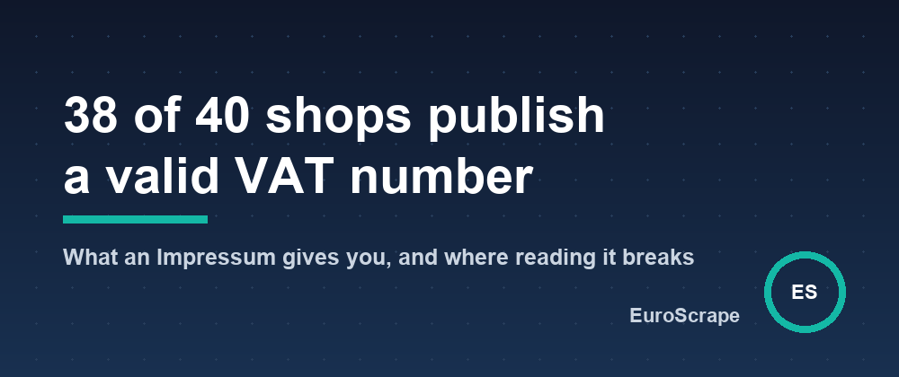

# 38 of 40 online shops in Germany publish a valid VAT number - what an Impressum gives you, and where reading it breaks

Germany requires every commercial website to say who runs it. The page is called the *Impressum*, and § 5 DDG (the former § 5 TMG) lists what goes on it: name and legal form, address, a quick way to get in touch, the register and its number, the VAT ID if there is one. France has its *mentions légales*, and most of Europe has an equivalent.

For anyone checking a supplier or completing a list of companies, that makes it the one page of a website where the facts are mandatory. I wanted to know how much of it a machine can read. On 8 October 2026 I took the first 40 shops that Trusted Shops returns for `fahrrad` on its German market, and ran their websites through the [Impressum & Legal Notice Scraper](https://apify.com/euroscrape/company-identity). Forty sites took 21 seconds on a laptop.

## What the page gives you

| Read on the site | Sites, of 40 |
|---|---|
| Company name | 39 |
| VAT ID | 38 |
| Email address | 38 |
| Postal address | 36 |
| Phone number | 35 |
| Legal form | 35 |
| Managing director or owner | 32 |
| Register number | 30 |

22 GmbH, 6 GmbH & Co. KG, 3 Dutch B.V. selling into Germany, 2 AG, one OHG, one GbR. One site, a Polish company, did not answer at all.

## Two outside checks

**VAT.** I sent every VAT ID found to VIES, the European Commission's validation service, with the [EU VAT Validator](https://apify.com/euroscrape/vat-validator). All 38 sites have a number that VIES confirms. But the scraper had found 45 numbers, and VIES refused five of them. I traced two: they are the start of the shop's bank account. `IBAN: DE08 4905 0101 ...` read without its spaces is "DE" plus nine digits, exactly the shape of a German VAT ID.

**Register.** Trusted Shops shows on each profile the register number it holds. It has one for 34 of the 40 shops, and 27 are identical to what the scraper read on the shop's own site. The seven others are the interesting part.

## The Impressum is mandatory, its format is not

- **The number without its prefix.** Two shops write `Handelsregister: Amtsgericht <court>, <number>`, with no "HRB" or "HRA" in front. A person reads that; a pattern looking for `HRB 12345` does not.
- **A foreign number in German clothes.** A Dutch company presents its Chamber of Commerce number as "Amtsgericht Arnheim, Niederlande, HRB" followed by eight digits. The scraper believed the label and dropped a digit. Another Dutch shop writes "Handelsregisternummer" in front of its number, a label the scraper does not know.
- **Other registers.** A cooperative sits in the *Genossenschaftsregister* (GnR), which the scraper does not read yet.
- **A page that is not text.** One large retailer serves its legal notice almost empty to a plain HTTP client, and the number came back cut to two digits.
- **The site that did not answer.**

## The error that matters

One shop is run by a sole trader: the legal notice names a person, not a company. The scraper returned instead a payment provider that is named in the shop's privacy policy. One site in forty, but it is a wrong company, not a missing field.

So each row says where its facts come from: `legalNoticeUrl` and `pagesScanned`. For French and British companies, `verifyInRegistry` goes further and checks the name against the official register (`nameMatches`). Germany has no free register API, so the check has to come from elsewhere: VIES for the VAT ID, or a second source as here.

## What you get per website

- `companyName`, `tradeName`, `legalForm`
- `registrations`: Handelsregister with its court, SIREN, Firmenbuch, UK company number, KvK and more
- `vatIds`, `managingDirectors`, `address`, `emails`, `phones`, `socials`
- `registryCheck` for France and the UK: official name, active or ceased, activity, creation date

The scraper is on Apify: [Impressum & Legal Notice Scraper](https://apify.com/euroscrape/company-identity), $0.004 per website. A ready-made run: [find the company behind any German shop](https://apify.com/euroscrape/company-identity/examples/find-the-company-behind-any-german-shop).

*One search, forty shops, one day: it shows what a legal notice contains and how reading it fails, not statistics on German e-commerce. No shop is named because the failures are the scraper's, not theirs. The misreads listed here are on the list of fixes.*

---

*Part of the [EuroScrape](https://apify.com/euroscrape) actor collection — [all articles](README.md).*
