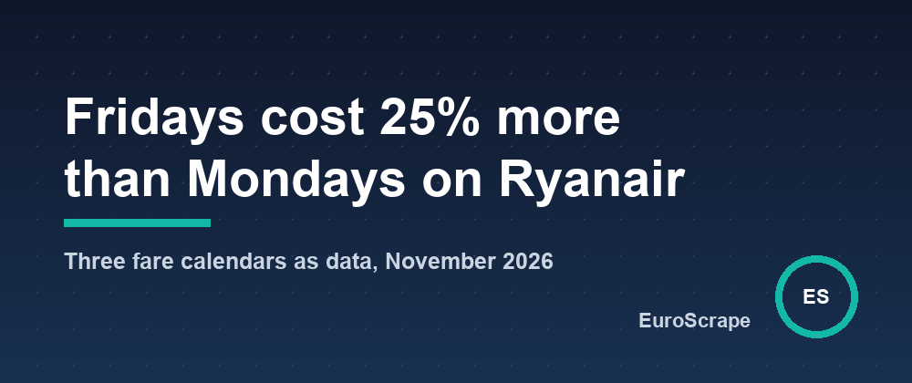

# Fridays cost 25% more than Mondays on Ryanair - what the November fare calendars of three routes look like as data



Ryanair prices every leg separately and every day separately. Its app shows the cheapest fare of each day of a month for one route at a time, which is fine for booking one trip and useless for a question like "which day of the week is expensive on this route?" or "where can I go for under 30 euros next month?".

The [Ryanair Low Fare Finder](https://apify.com/euroscrape/ryanair-low-fares) reads that same fare calendar from Ryanair's own fare-finder API and returns it as rows: one row per day and route, plus a summary per route. On 9 October 2026 I asked it for the November 2026 calendar of five routes, one way, in euros. Four seconds on a laptop, 75 fares. This article is about what those rows show, with ratios rather than price lists: the fares belong to Ryanair, they change every day, and a table of them would be stale before you read it.

## Three routes, three shapes

| Route | Days with a flight in November | Cheapest day | Most expensive day | Most expensive / cheapest |
|---|---|---|---|---|
| London Stansted to Dublin | 30 | Sunday 1 November | Friday 20 November | 1.4x |
| Milan Bergamo to London Stansted | 30 | Saturday 7 November | Sunday 1 November | 5.6x |
| Berlin to Alicante | 14 | Thursday 26 November | Friday 13 November | 2.3x |

Three routes, three different objects:

- **Stansted to Dublin** is a shuttle. A flight every day, fares between 14.99 and 21.49 euros for the whole month, a median of 17.99. Whatever day you pick, you are within 7 euros of the best price.
- **Bergamo to Stansted** has a floor and spikes. On 16 of the 30 days the cheapest fare is 14.99 euros, and the median of the month is that floor. The other days climb to 84.10 euros on Sunday 1 November, All Saints' Day, when Italy comes back from a long weekend. The same seat costs 5.6 times more depending on the day.
- **Berlin to Alicante** flies four days a week (Monday, Thursday, Friday, Sunday) and the fares are simply higher: 32.99 euros at best, 75.82 at worst, a median of 56. There is no floor fare on this route in November.

## Fridays

I put the 74 fares of these three routes on one scale: each fare divided by the median of its own route, so that a 60-euro Berlin fare and a 15-euro Dublin fare can sit in the same table. Then I grouped them by day of the week.

| Day of departure | Fares | Median price, relative to the route's median |
|---|---|---|
| Monday | 15 | 1.00 |
| Tuesday | 8 | 1.00 |
| Wednesday | 8 | 1.03 |
| Thursday | 12 | 1.11 |
| Friday | 12 | 1.25 |
| Saturday | 8 | 0.94 |
| Sunday | 11 | 1.00 |

Friday departures run 25% above the route median, Thursdays 11% above, Saturdays 6% below. Monday, Tuesday and Sunday sit at the median. One month and three routes is a small sample and I would not quote the 25% to anyone as a law of Ryanair pricing. But the shape matches what anyone who books short trips knows by feel: leaving on Friday evening is where the airline earns its money, and the Saturday morning flight is the quiet one.

## Where can I fly for under 30 euros

The second thing the Actor does is the reverse question. Instead of a route, you give it an airport and a price cap, and it returns every destination with at least one fare under the cap in the next 31 days, cheapest first.

| From | Destinations at or under 30 euros | Countries | Cheapest |
|---|---|---|---|
| Paris Beauvais | 12 | Spain, Italy, United Kingdom, Hungary, Romania, Morocco | Málaga and Bergamo, 14.99 |
| Berlin | 9 | Spain, Italy, Ireland, Hungary, Croatia, Greece | Málaga, 14.99 |

Málaga at 14.99 euros from both Paris and Berlin on the same morning is the floor fare again: Ryanair seems to open many routes at that price and raise it as the plane fills. In monitor mode, the Actor can watch an airport every day and send a message when any fare at or under your cap appears, which is the only practical way to catch those seats.

## The route that came back empty

I asked for five routes and got three usable calendars. Madrid to Brussels returned nothing because Ryanair does not fly it (it flies Madrid to Charleroi): the Actor reports the route as having no fares rather than guessing a nearby airport. Paris Beauvais to Málaga returned a single day in November, 1 November at 14.99 euros, and nothing at all for December. I cannot tell from the data whether the winter schedule was not loaded yet on 9 October or whether the route is seasonal, so I left it out of the comparison. It is a good reminder of what a fare calendar is: the cheapest *available* fare of each day, as Ryanair's system sees it at the moment you ask, not a timetable.

## How to do it

The whole run is one input:

```json
{
  "routes": ["BER-ALC", "STN-DUB", "BGY-STN"],
  "months": 1,
  "startMonth": "2026-11",
  "airports": ["Paris Beauvais", "Berlin"],
  "maxPrice": 30,
  "currency": "EUR"
}
```

Every fare row carries the route, the date, departure and arrival times, the price and whether the day is sold out. Every destination row carries the flight number and the time Ryanair last refreshed the fare. Each route gets a summary (cheapest day, median, cheapest day of each month) and each airport a top 10. With a `monitorName` and a daily schedule, each run flags new fares and price changes since the previous one, and can alert you on Telegram, Discord, Slack or a webhook when a fare drops by a percentage or falls under a price.

It costs $0.0005 per calendar fare and $0.001 per destination, plus $0.003 per run: the run behind this article is about 6 cents.

*Fares read from Ryanair's fare-finder API on 9 October 2026, one way, in euros, before extras. They change daily and are quoted here as examples only; the point of the article is the method and the ratios, not the prices.*

---

*Part of the [EuroScrape](https://apify.com/euroscrape) actor collection — [all articles](README.md).*
