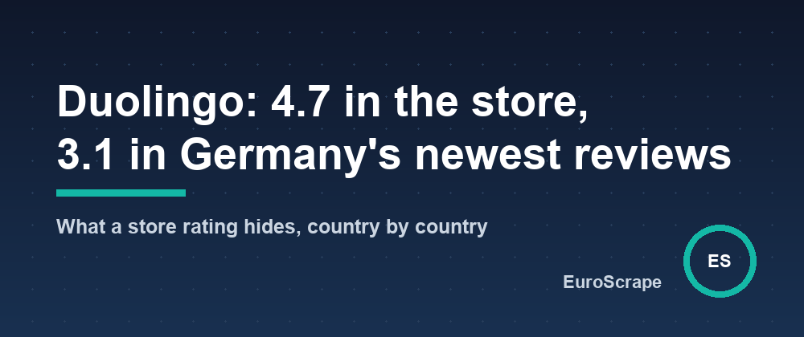

# Duolingo is rated 4.7 in both app stores, and its newest reviews in Germany average 3.1 - what a store rating hides, country by country



The rating on an app's store page is a lifetime average. Duolingo's is 4.72 on the App Store and 4.73 on Google Play, built on 5.5 million and 50 million ratings. It will not move whatever happens this month. The reviews written this week are where the news is, and they are split across two stores and dozens of country storefronts, each one a separate page.

On 9 October 2026 I ran the [App Store Reviews Scraper + Google Play Reviews](https://apify.com/euroscrape/app-reviews) on Duolingo by name, with the 50 newest reviews per country in eight countries on both stores. One run, 55 seconds on a laptop, 760 reviews, plus a summary per store that the Actor adds for free. This article is what that summary shows, and where it does not.

## The newest reviews run half a star to a full star below the store rating

| | App Store | Google Play |
|---|---|---|
| Store rating (lifetime) | 4.72 | 4.73 |
| Average of the newest reviews collected | 3.81 (360 reviews) | 4.20 (400 reviews) |
| Share of 1 and 2 star reviews | 24% | 15% |
| Developer replies | not exposed by Apple's feed | 0 of 400 |

Nothing dramatic: a very popular app with a lifetime 4.7 can live for years with its newest reviews at 3.8 or 4.2, because most happy users never write anything. But a product team that only looks at the 4.7 is not looking at anything.

## Germany is the outlier on both stores

| Country | App Store, newest 50 | Google Play, newest 50 |
|---|---|---|
| United States | 3.78 | 4.26 |
| United Kingdom | 3.90 | 4.26 |
| France | 3.88 | 4.34 |
| Germany | **3.14** | **3.56** |
| Spain | 3.64 | 4.64 |
| Italy | 4.16 | 4.02 |
| Brazil | 4.26 | 4.58 |
| Japan | not usable (see below) | 3.94 |

The same app, the same week, and Germany sits half a star to a full star below every other country, on both stores. Two independent stores agreeing on the same country is the kind of signal a single store page cannot give you. I do not know why from the numbers alone. The negative-review topics give a hint: on the App Store the most frequent words in 1 and 2 star reviews were *annoying*, *energy* and *money*; on Google Play *gems*, *streak*, *energy* and *premium*. German reviews contribute their own vocabulary to that list (*lernen*, *Fehler*). Reading the German reviews themselves is the next step, and they are all in the dataset, with their text, rating, version and date.

## The version split

Google Play reviews carry the app version. In the 400 newest reviews, 220 were written on version 6.99.5 and averaged 4.38; 97 were on the newer 6.100.3 and averaged 4.07. A third of a star between two consecutive releases, on a sample of a hundred reviews, is worth a look but not a conclusion. The Actor's summary gives this table for every version it sees, so you can watch it move from one day to the next.

## Where the method breaks

**Apple's feed runs dry in smaller storefronts.** The App Store gives the newest reviews per country through a feed that is sometimes empty. For Japan it was, and the Actor fell back to the store page, which only exposes ten reviews, some of them years old. The average of those ten (3.2) means nothing and is left out of the table above. A fix is on my list: say so explicitly in the output rather than return ten old reviews quietly.

**50 reviews is a week, not a quarter.** On Google Play, the 400 reviews span 2 to 8 October: the sample is recent, which is the point, and small, which is the limit. The country figures above are a snapshot. The Actor is built to be run on a schedule: with a monitor name, each run returns only the reviews that are new since the previous one, and can send every new 1 or 2 star review to Slack, Telegram, Discord or a webhook.

**Reviewer names are off.** The dataset carries the review text, rating, title, version, date, country and the developer's reply when there is one. Reviewer names are personal data and are not collected unless you ask.

## How to do it

```json
{
  "appNames": ["Duolingo"],
  "countries": ["us", "gb", "fr", "de", "es", "it", "br", "jp"],
  "maxReviewsPerCountry": 50,
  "includeAppDetails": true,
  "includeSummary": true
}
```

The app name is enough: the Actor finds the app on both stores. URLs, App Store IDs and Android package names work too. Each run returns the reviews, one item per app with its store details (rating, number of ratings, version, installs, developer), and one summary per store: rating distribution, average per country, average per version, share of negative reviews, developer reply rate, topics of the negative reviews. The run behind this article costs about 15 cents: $0.0002 per review, plus $0.003 per run.

*Reviews read on 9 October 2026 from the public App Store and Google Play storefronts of eight countries, newest first, 50 per country and store. Averages are of the collected reviews only and say nothing about the apps' lifetime ratings. No reviewer is named.*

---

*Part of the [EuroScrape](https://apify.com/euroscrape) actor collection — [all articles](README.md).*
